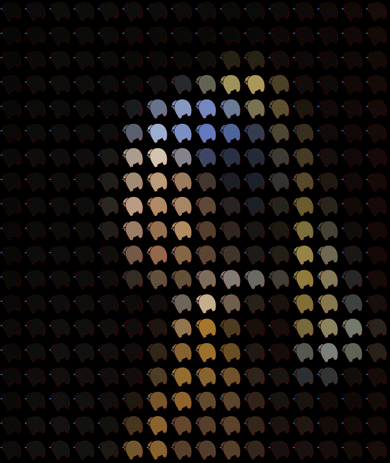

# Image to Amogus Converter

Converts given image (.png, .jpg, etc) to an amogus gif!

# Usage 

Place image in the `/target/` folder (or anywhere realistically, assuming you can get its path). 
Next, type the following into the console: 

```console
$ python amogus.py path [-size]
```

Where `path` is a required string relating to the path of the target image and `-size` is an optional parameter relating to the size of the outputted .gif (see `-h` for details). 

```console
$ python amogus.py -h
usage: image_to_amogus [-h] [-size SIZE] path

positional arguments:
  path        Path to target image, where the /target/ folder is the current
              directory.

optional arguments:
  -h, --help  show this help message and exit
  -size SIZE  Integer representing the side length of square images, and the
              length of the shortest side in rectangular images (16 by
              default).
```

# Example 

Here's an example of the program run on the <i>Girl with a Pearl Earring</i>. 


Examples: 

```console
$ python amogus.py example.jpg
example_amogus.gif saved in ../output/ folder. So sussy! ඞ
```


```console
$ python amogus.py example.jpg -size=8
example_amogus.gif saved in ../output/ folder. So sussy! ඞ
```


```console
$ python amogus.py example.jpg -size=32
example_amogus.gif saved in ../output/ folder. So sussy! ඞ
```


```console
$ python amogus.py example.jpg -size=64
example_amogus.gif saved in ../output/ folder. So sussy! ඞ
```

